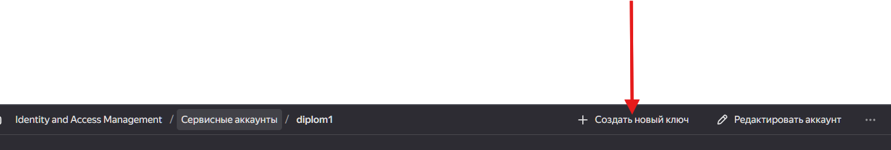
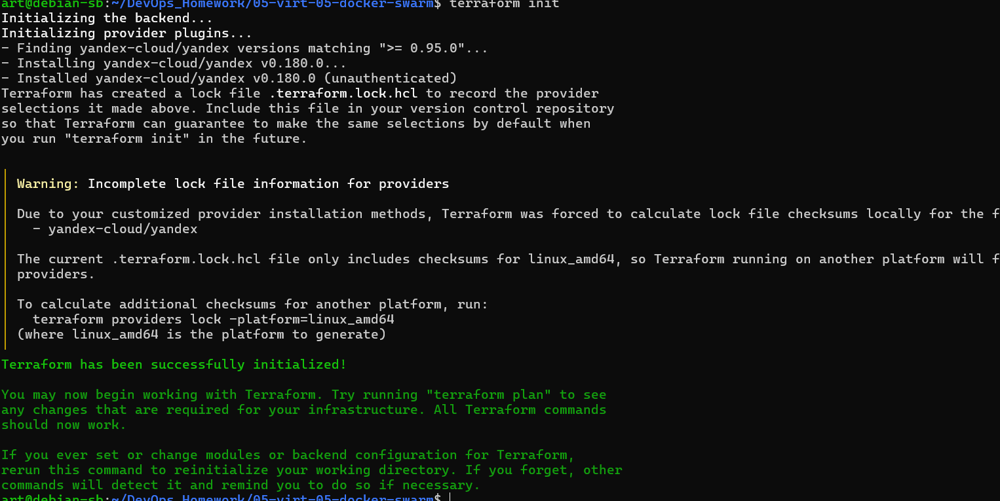

## Установим terraform и ansible
```
apt get install ansible
```


возбмем из задания 6
https://github.com/htment/DevopsHomework_shvirtd-example-python


```
 cp ~/terraform_extract/terraform_local 
```


# Погототовим terraform для работы с YC


## Создаим файл .terraformrc в папке пользователя

```
provider_installation {
  network_mirror {
    url = "https://terraform-mirror.yandexcloud.net/"
    include = ["registry.terraform.io/*/*"]
  }
  direct {
    exclude = ["registry.terraform.io/*/*"]
  }
}
```


## Создадим скачаем .authorized_key.json из YAndexCloud




## Создадим provider.tf

```
provider "yandex" {
  cloud_id                 = var.yandex_cloud_id
  folder_id                = var.yandex_folder_id  
  service_account_key_file = file("~/.authorized_key.json")
  zone      = "ru-central1-a"
}

```

Создаим файл terraform.tfvars с содержимым:


```
yandex_cloud_id  = "your_cloud_id"
yandex_folder_id = "your_folder_id"
yandex_token     = file("~/.authorized_key.json")
```

объявим переменные в variables.tf
```
variable "yandex_cloud_id" {}
variable "yandex_folder_id" {}
variable "yandex_zone" {
  default = "ru-central1-a"
}


```
```
terraform init
```
