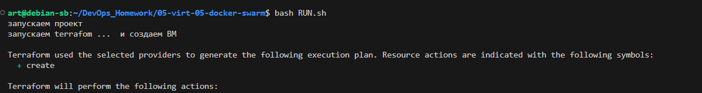
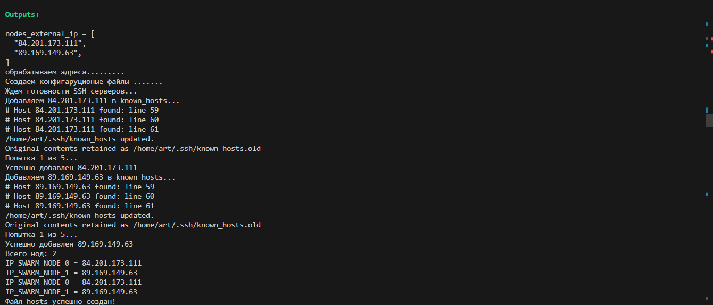
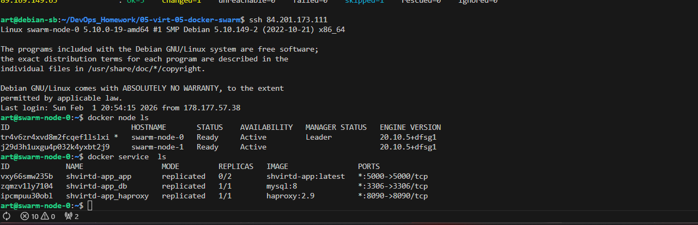

# Попрробуем  docker in docker
[DInD](test_docker/README.md)

# Установим terraform и ansible
```
apt get install ansible
```


возбмем из задания 6
https://github.com/htment/DevopsHomework_shvirtd-example-python


```
 cp ~/terraform_extract/terraform_local 
```


# Погототовим terraform для работы с YC


## Создаим файл .terraformrc в папке пользователя

```
provider_installation {
  network_mirror {
    url = "https://terraform-mirror.yandexcloud.net/"
    include = ["registry.terraform.io/*/*"]
  }
  direct {
    exclude = ["registry.terraform.io/*/*"]
  }
}
```


## Создадим скачаем .authorized_key.json из YAndexCloud


## Создадим provider.tf

```
provider "yandex" {
  cloud_id                 = var.yandex_cloud_id
  folder_id                = var.yandex_folder_id  
  service_account_key_file = file("~/.authorized_key.json")
  zone      = "ru-central1-a"
}

```

Создаим файл terraform.tfvars с содержимым:


```
yandex_cloud_id  = "your_cloud_id"
yandex_folder_id = "your_folder_id"
yandex_token     = file("~/.authorized_key.json")
```

объявим переменные в variables.tf
```
variable "yandex_cloud_id" {}
variable "yandex_folder_id" {}
variable "yandex_zone" {
  default = "ru-central1-a"
}


```
```
terraform init
```


##  Создадим cloud-init.yml для создания пользователей на ВМ 
```
users:
  - name: art
    groups: sudo
    shell: /bin/bash
    sudo: ['ALL=(ALL) NOPASSWD:ALL']
    ssh_authorized_keys:
      - ssh-ed25519 ваш ключ

  - name: admin
    groups: sudo
    shell: /bin/bash
    sudo: ['ALL=(ALL) NOPASSWD:ALL']
    lock_passwd: false
    passwd: "$6$rounds=4096$wPs2z7VqC9$X6q5h7W8pY2rT3sV1qZ9mN0bC4dF7gH2jK5lP8oR6tS9uY4vAxE3zB1cM6nDf" # зашифрованый пароль 1-6 (так лучше не делать, это только в учебных целях)

ssh_pwauth: true
disable_root: false
chpasswd:
  list: |
    admin:123456
  expire: false
```


# Создадим скрипт  запуска RUN.sh и запустем его 



